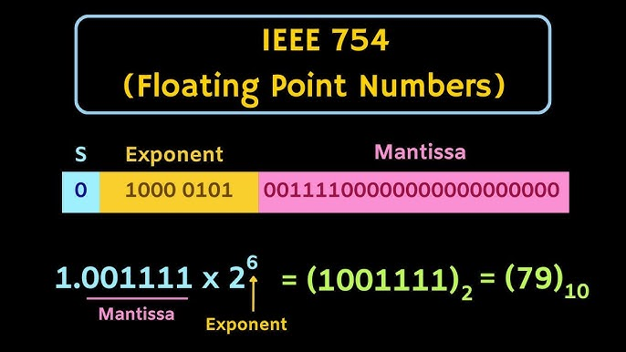

# IEEE 754 Floating‑Point Exploration

An educational project exploring how computers represent real numbers using the **IEEE‑754 double‑precision floating‑point standard**.

This project was created during the early stages of learning programming to understand why calculations such as:

```
0.1 + 0.2 !== 0.3
```

produce unexpected results like:

```
0.30000000000000004
```

Instead of relying on built‑in libraries, this implementation attempts to convert decimal numbers into a binary‑style representation inspired by IEEE‑754 to visualize approximation and precision limits.

---

## 🖼️ Preview



---

## 🧠 What This Project Demonstrates

- How decimal numbers are approximated in binary
- The structure of IEEE‑754 double‑precision numbers
- Why floating‑point rounding errors occur
- The relationship between sign, exponent, and mantissa
- Practical examples of precision loss in programming

---

## 🔬 IEEE‑754 Double Precision Layout (64‑bit)

```
[ Sign (1) | Exponent (11) | Fraction / Mantissa (52) ]
```

### 🔹 Sign Bit
- 0 → Positive
- 1 → Negative

### 🔹 Exponent
Stored using a bias of **1023**:

```
storedExponent = actualExponent + 1023
```

### 🔹 Fraction (Mantissa)
Represents the normalized value:

```
1.fraction × 2^exponent
```

The leading `1` is implicit and not stored.

---

## ⚠️ Why Floating‑Point Errors Happen

Many decimal numbers cannot be represented exactly in binary.

For example:

```
0.1₁₀ = 0.0001100110011…₂ (repeating forever)
```

Since only a limited number of bits can be stored, the value is rounded, causing small errors that appear during arithmetic operations.

---

## 🎯 Purpose of This Project

This project focuses on learning and visualization rather than production‑level accuracy.

It demonstrates:

- Bit‑level thinking
- Numeric representation concepts
- Low‑level algorithmic experimentation
- Understanding beyond built‑in functions

---

## ⚠️ Disclaimer

This is **not a full or mathematically exact IEEE‑754 implementation**.

It is a simplified educational experiment intended to help beginners understand how floating‑point numbers work internally.

---

## 📄 License

MIT License
